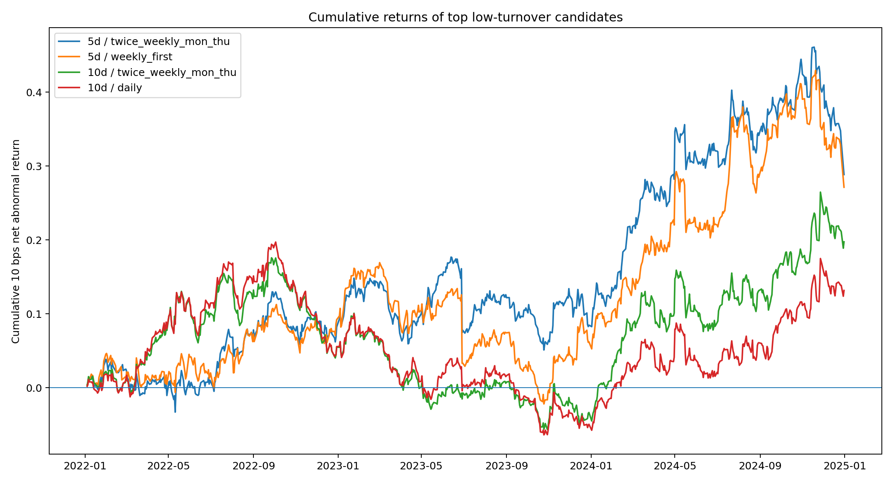
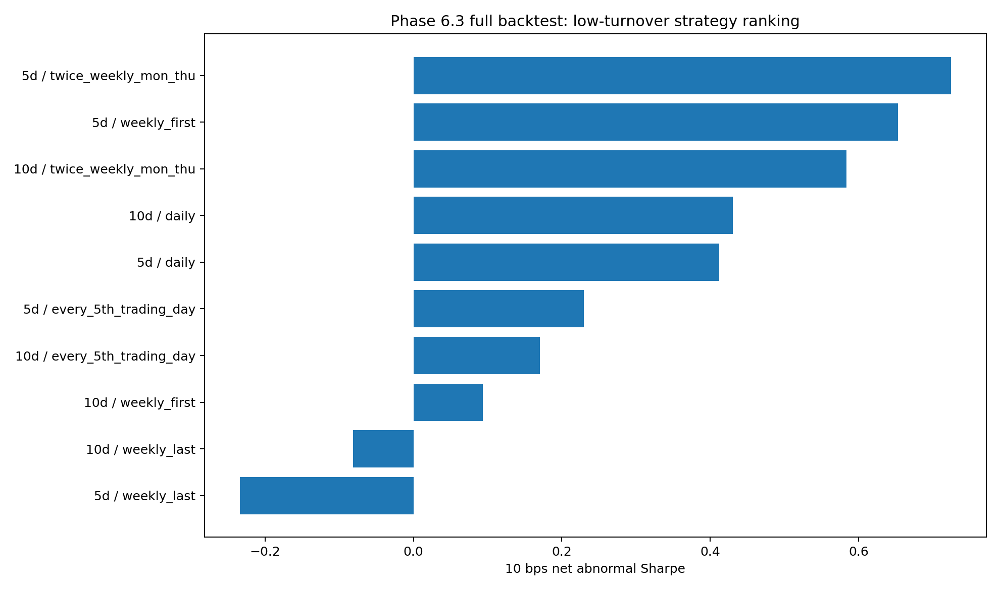
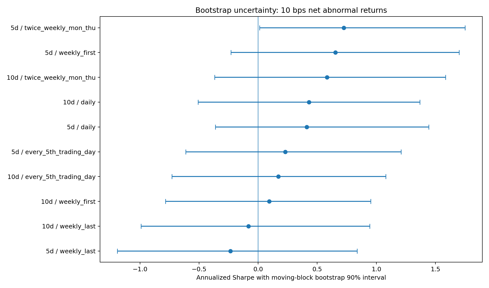
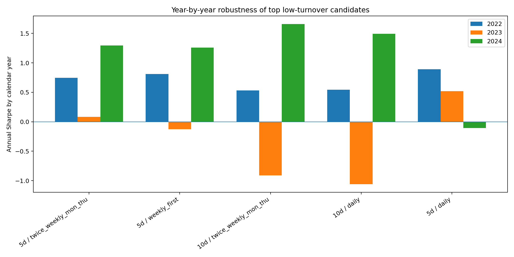
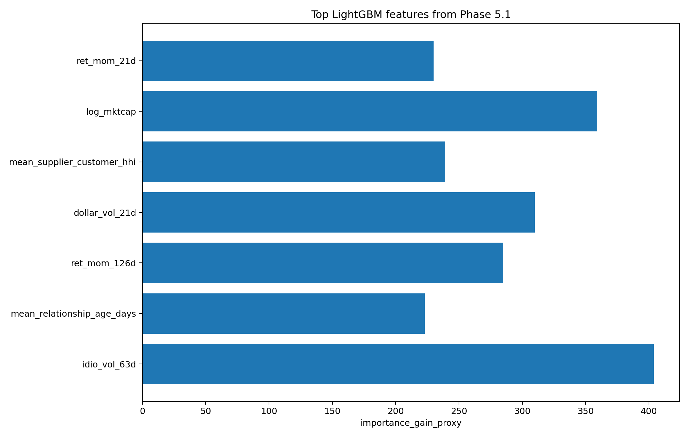
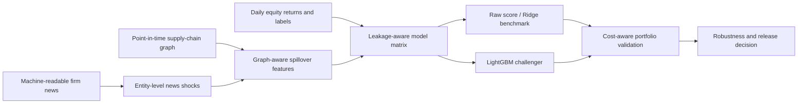

# Production Network Alpha

<p align="center">
  <b>Research-grade equity signal pipeline for testing whether firm news propagates through point-in-time supply-chain links into connected-stock return predictability.</b>
</p>

<p align="center">
  <b>Python 3.12 · Research candidate · Public-safe synthetic/aggregate release · MIT License</b>
</p>

<p align="center">
  
</p>

## Executive summary

This repository is a public-safe version of a full-stack empirical asset-pricing project. The private research pipeline builds a point-in-time supplier–customer graph, maps machine-readable firm news into graph-aware shocks, constructs CRSP-style forward-return labels, trains transparent and nonlinear models, and evaluates cost-aware long/short portfolios.

The final result is intentionally framed as a **research candidate**, not a deployed or live trading system. The public repo contains code, documentation, aggregate result tables, figures, and a synthetic demo. Raw WRDS/vendor data and protected local Parquet caches are excluded.

## Research question

> When a firm receives a material news shock, do economically connected firms exhibit delayed abnormal returns that can be forecast from the direction, intensity, and network location of that shock?

The economic intuition is that supply-chain relationships create real exposure. A supplier shock can affect customers through input costs, delays, and production risk; a customer shock can affect suppliers through demand, margins, and bargaining power. The project tests whether markets process these second-order implications slowly enough to create measurable connected-equity predictability.

## Headline result

| Item | Public release value |
|---|---:|
| Selected research candidate | LightGBM, 5-day horizon, twice-weekly rebalance |
| Out-of-sample period | 2022–2024 |
| Cost assumption | 10 bps one-way turnover cost |
| Net abnormal Sharpe | 0.724 |
| Cumulative net abnormal return | 28.85% |
| Max drawdown | -11.80% |
| HAC t-stat | 1.28 |
| Positive Sharpe years | 3 / 3 |
| Decision status | Research candidate; not production/live trading |

The statistical evidence is economically interesting but not strong enough to claim a production-ready strategy. That is the point: the repo emphasizes disciplined data engineering, leakage control, model comparison, cost-aware validation, and honest research judgment.

## Visual results

<table>
<tr>
<td width="50%">
  
  <br><b>Cost-aware candidate ranking.</b><br>
  Low-turnover LightGBM variants dominate after transaction costs.
</td>
<td width="50%">
  
  <br><b>Bootstrap uncertainty.</b><br>
  The selected candidate is positive in the bootstrap distribution, but uncertainty remains meaningful.
</td>
</tr>
<tr>
<td width="50%">
  
  <br><b>Year-by-year robustness.</b><br>
  The selected family is positive across 2022–2024, but performance is not uniform.
</td>
<td width="50%">
  
  <br><b>Model explainability.</b><br>
  The strongest predictors combine propagated news shocks, network exposure, and firm-level controls.
</td>
</tr>
</table>

## Pipeline architecture



## What is public here

| Component | Included? | Notes |
|---|---:|---|
| Research code structure | Yes | Package layout, scripts, tests, examples |
| Figures | Yes | Aggregate, public-safe result figures |
| Aggregate result tables | Yes | No row-level vendor data |
| Synthetic demo data | Yes | Generated locally from `examples/synthetic_demo` |
| Raw WRDS / RavenPack / CRSP data | No | Excluded by policy |
| Local credentials or cluster logs | No | Excluded and scanned before release |

## Public aggregate tables

The public-safe aggregate tables are in:

```text
artifacts/release_public/
```

Key files:

```text
phase7_0_10bps_candidate_ranking.csv
phase7_0_bootstrap_robustness.csv
phase7_0_phase6_1_vs_6_3_comparison.csv
phase7_0_validation_diagnostics.csv
phase7_0_yearly_top_candidates.csv
```

## Quickstart: run the synthetic demo

The public demo does not require WRDS or vendor data.

```bash
python examples/synthetic_demo/run_synthetic_demo.py
```

Expected output:

```text
synthetic_demo_rows 3200
synthetic_demo_r2 0.071327
synthetic_demo_coef [...]
```

## Repository map

```text
production-network-alpha/
├── README.md
├── DATA_POLICY.md
├── docs/
│   ├── research_report.md
│   ├── interviewer_briefing.md
│   ├── release_notes.md
│   └── figures/
├── artifacts/
│   └── release_public/
├── examples/
│   └── synthetic_demo/
├── src/
│   └── production_network_alpha/
├── scripts/
├── tests/
└── .github/workflows/
```

## Skills demonstrated

| Area | What this project demonstrates |
|---|---|
| Data engineering | WRDS-scale schema discovery, point-in-time joins, protected local caches |
| Financial ML | Leakage-aware labels, walk-forward validation, rank IC, decile tests |
| Network science | Directed supplier–customer graph features and propagated shocks |
| NLP / alternative data | Entity-level machine-readable news shocks |
| Backtesting | Turnover-aware portfolios, transaction-cost frontiers, HAC diagnostics |
| Release engineering | Public-safe packaging, synthetic demos, CI, data-policy discipline |

## Data policy

This public repository intentionally excludes raw WRDS/vendor data, credentials, local cluster logs, and protected Parquet caches. See [`DATA_POLICY.md`](DATA_POLICY.md).

## Status and next credibility checks

This is a **research candidate**, not a deployed strategy. Before any real capital deployment, the next credibility checks would be:

1. independent sample extension or third-party replication;
2. deeper execution-cost modeling with liquidity and capacity constraints;
3. broader placebo tests and alternative news/entity mappings;
4. live paper-trading with frozen code and pre-registered decision rules.

## License

Code is released under the MIT License. Figures and documentation are intended for public research presentation only. Third-party data products are not redistributed.
